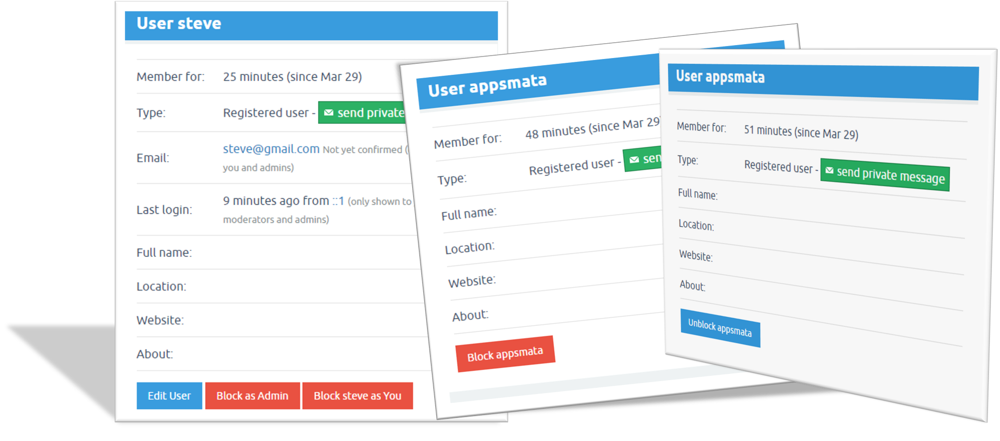

# Q2A ADVANCED BLOCKER PLUGIN 
Give normal site users the privilege to block users

## Installing Instructions
If you have never installed my Q2A plugins before please consider checking the [Installation Guide](https://github.com/JacksiroKe/q2a-advanced-blocker/blob/master/INSTALLING.md)

## FEATURES OF THE PLUGIN
1. Admin User: Block user as an admin or just as a user
2. Normal User: Block user
3. Unblock user
